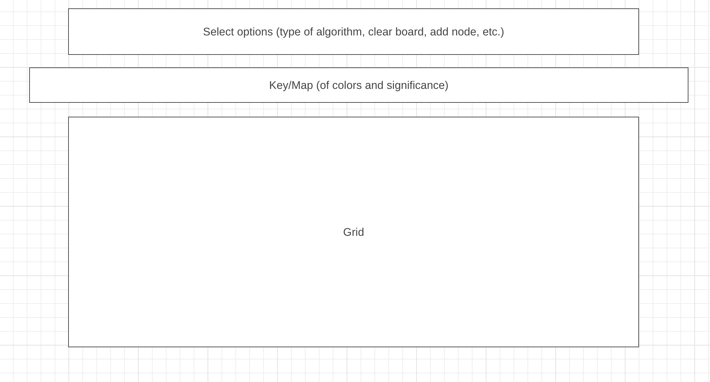

# Background

A pathfinding, interactive demo that allows you to place start and end nodes on a matrix-grid
and use different algorithms to find a path from the start to the end node.

# Functionality & MVPs

In PathFinder, users will be able to:

 - Place start and end nodes
 - Place walls
 - Select a pathfinding algorithm (BFS, DFS, or Dijkstra's Algorithm)
 - Clear the grid and start over

In addition, this project will include:

 - Select the speed of the visualization
 - Add additional floors and elevators
 - To select between a weighted or unweighted graph

# Wireframe

# Technologies, Libraries, APIs

No additional libraries or APIs will be used for this project. 

# Implementation Timeline

Friday Afternoon & Weekend - Implement grid and setting up the board with start node, end node and walls.
Also include option to add more floors (max 3) and elevators nodes. Implement clearing/resetting the board and basic nav-header menu.

Monday - Implement logic of BFS, DFS, and Dijkstra's.

Tuesday - Implement visualization of visited nodes (and speed options), back-tracing path, and finally
the path from start to finish.

Wednesday - Implement landing page + implement areas that needs to be worked on.

Thursday Morning - Continue implementing areas that need to be worked on.

(If additional time): Implement a weighted graph and visualize Dijkstra's Algorithm.

# Checklist

Live Project
 - Includes links to your portfolio website, Github, and LinkedIn.
 - Landing page/modal with obvious, clear instructions.
 - Interactivity of some kind.
 - Well styled, clean frontend.
 - If it has music, the option to mute or stop it.

Production README
 - Link to live version.
 - Instructions on how to play/interact with the project.
 - List of technologies / libraries / APIs used.
 - Technical implementation details with (good-looking) code snippets.
 - To-dos / future features.
 - No .DS_Store files / debuggers / console.logs.
 - Organized file structure, with /src and /dist directories.