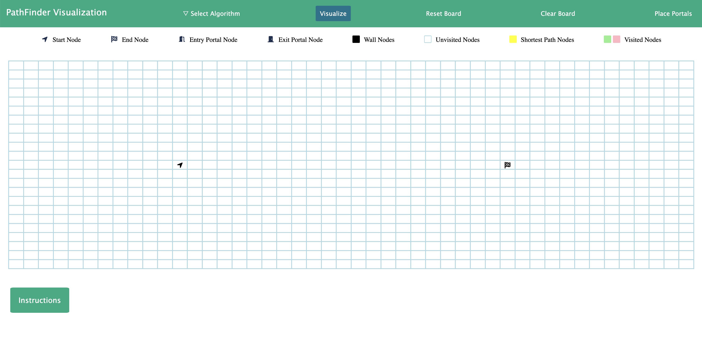
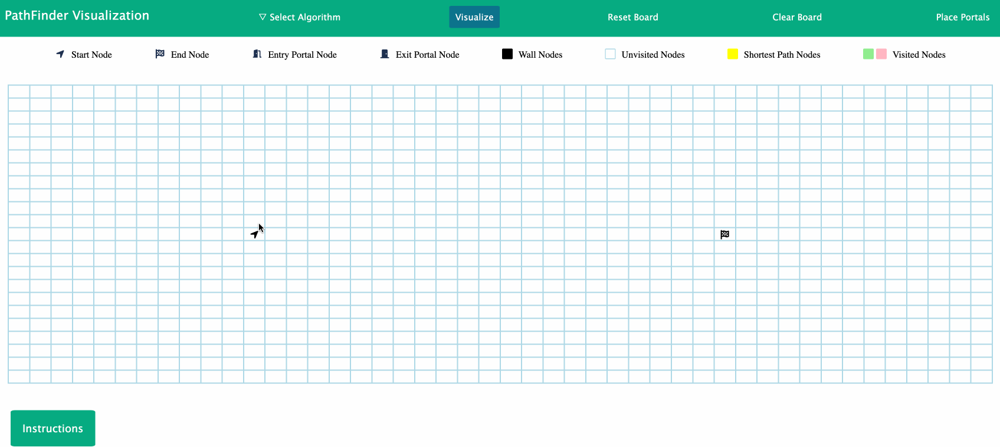
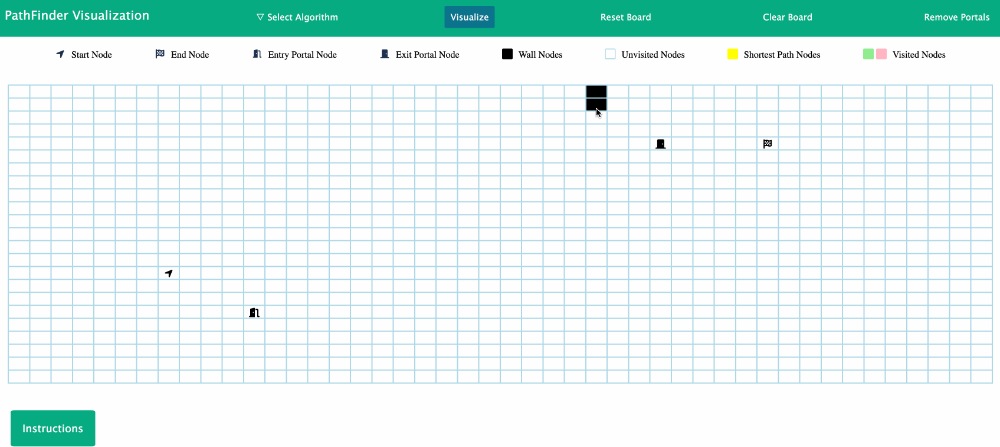
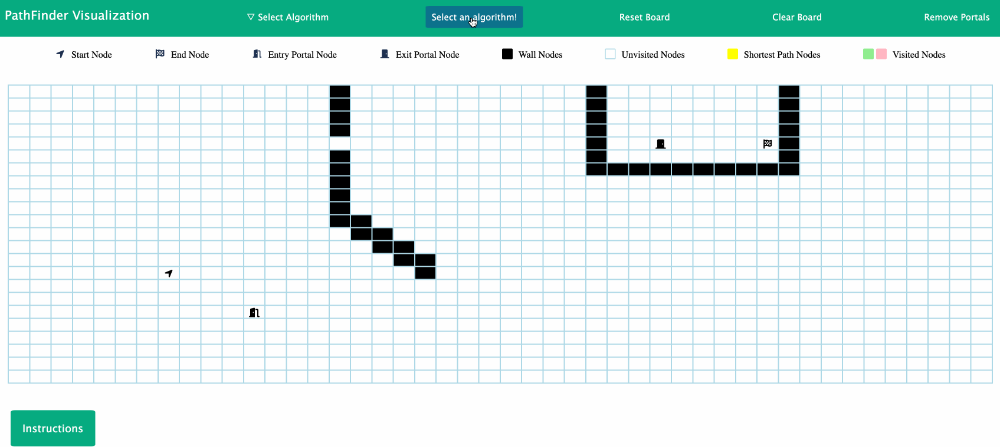
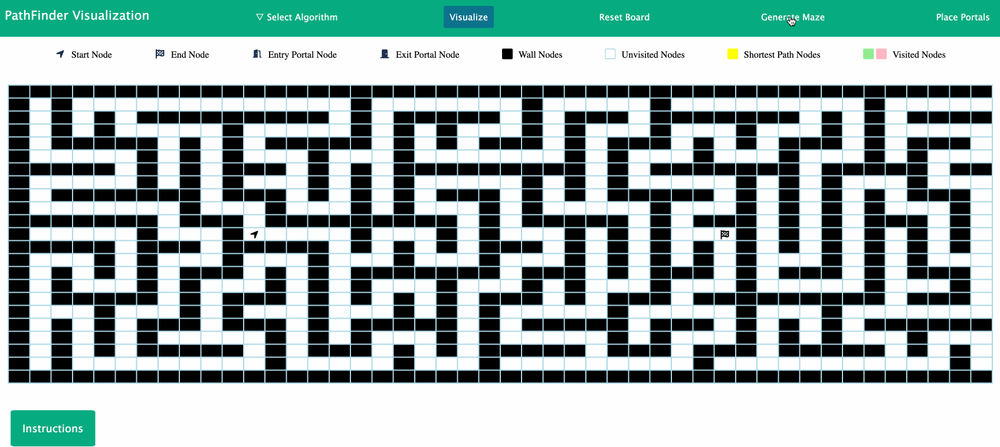
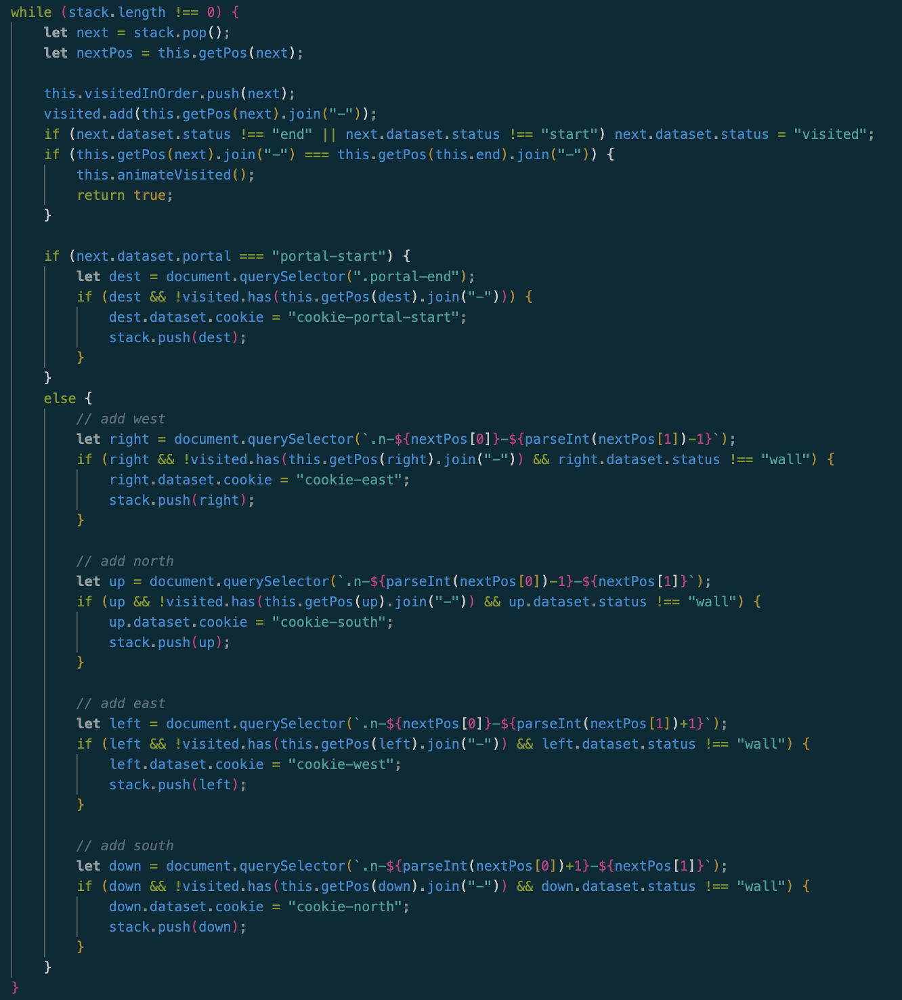
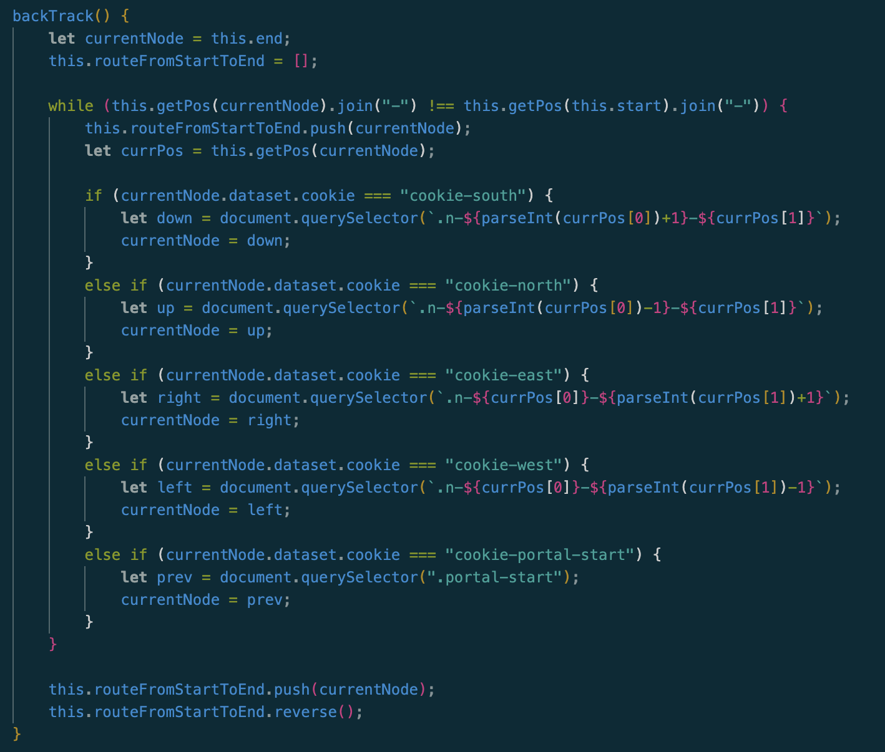
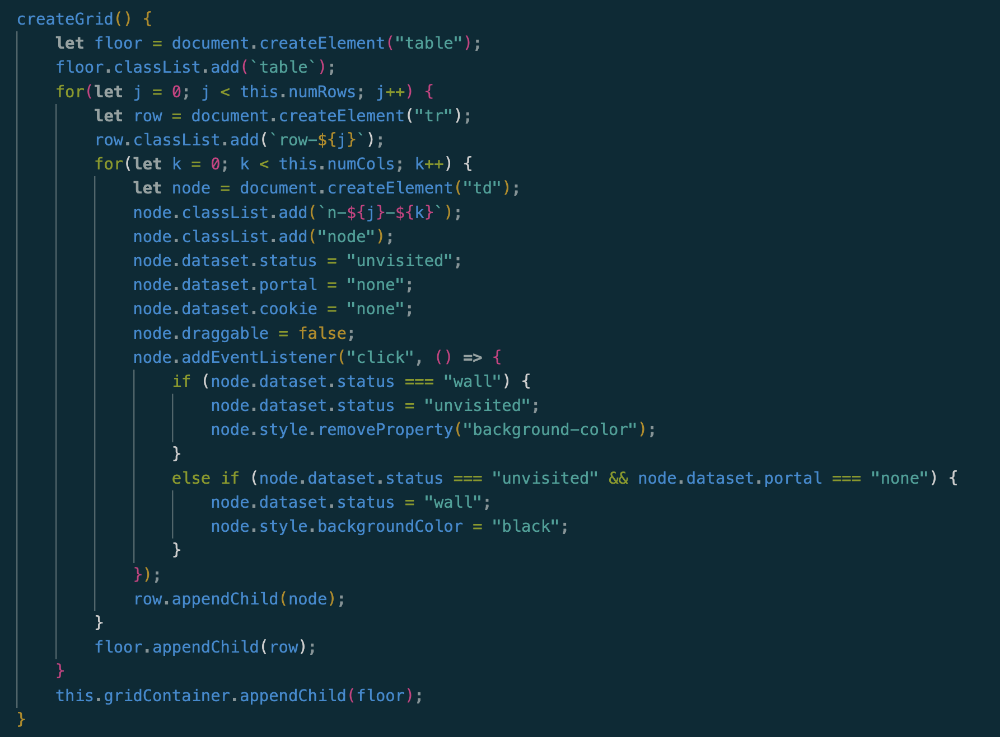
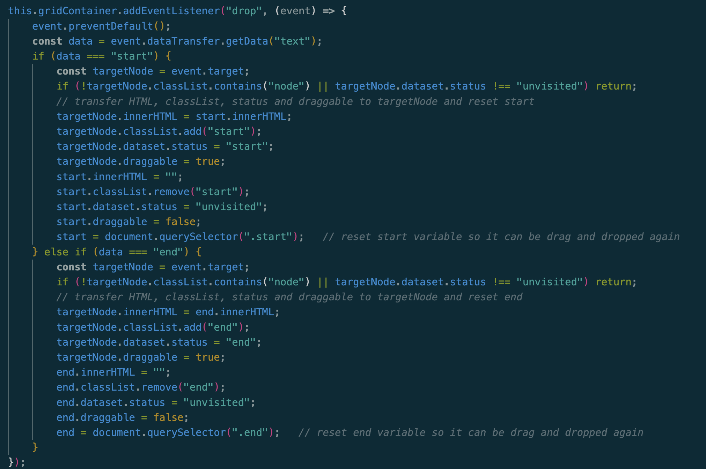

# Background

A pathfinding, interactive demo that allows you to place start and end nodes on a matrix-grid
and use different algorithms to find a path from the start to the end node.

# Technologies, Libraries, APIs

This was written entirely in Vanilla JS, HTML and CSS. Also utilized webpack, babel and sass.

# Live Link

Hosted on personal portfolio with github pages.
[Pathfinder Visualization Demo Link](https://www.junjason.com/PathFinder/)

# Features to add later

- place portals where walls don't exist, will utilize BFS for worst case scenarios
- add auto generate wall features
- add weights and algorithms such as A* and Dijkstra's that account for weights
- and more!

# How to use

- Start and End nodes render when website loads. You can drag and drop them to different nodes/squares.
- You can place portals and remove portals by clicking "Place Portals" and "Remove Portals".
    - You can move by dragging-and-dropping portals.
- Place walls by clicking on an empty node.
- Select an algorithm.
- Click Visualize
    - Pink/Green squares represent visited nodes and Yellow squares represent optimal path (by algorithm).
    - DFS does not guarantee the optimal path, while BFS does.

# Simple Overview

Website splash page

Here is what you can do!

You can move start and end nodes, which looks like this:

You can place walls:

And finally, you can place portals, and visualize your algorithm:

Additionally, you can generate a maze before running the algorithm:

# Important Classes

Grid.js
- Responsible for creating grid and adding to HTML (createGrid())
- Placing portals
- Resetting and Clearing the grid
- Event listeners for wall logic

Route.js
- Finds a path from start to end node using runDFS() and runBFS()
- backTrack() finds the "optimal" path from end to start using cookies
- animateBackTrack() and animateVisited() are asynchronous function responsible for the animations

Across grid.js and route.js, states of each node is kept by using node.dataset.*
For instance, node.dataset.cookies keeps track of cookie-direction.

# Vital Code Snippets 

Main logic of bfs and dfs

Backtrack logic

Create grid function

Drop event listener for drag and drop functionality for start and end nodes

